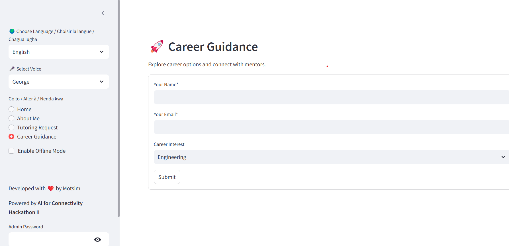
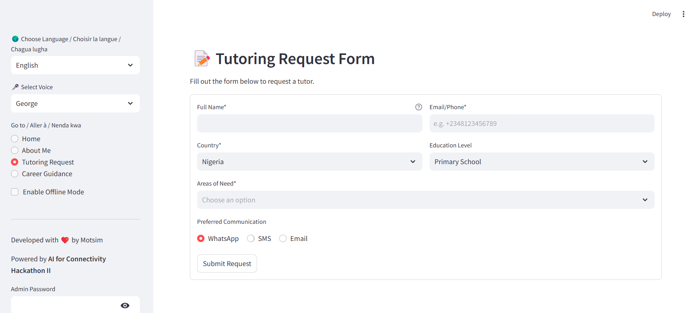
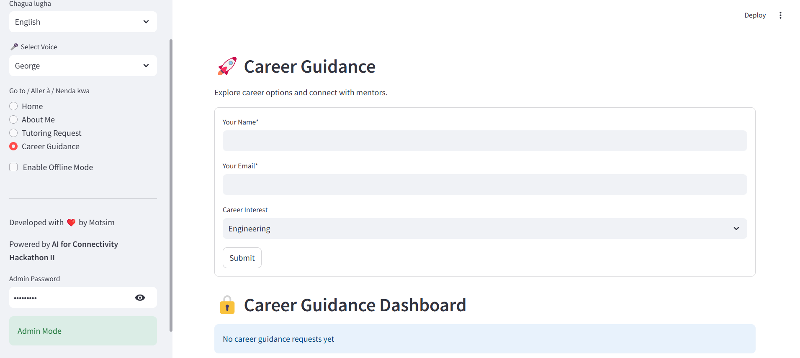

# AfriLearn AI Tutor 🌍

## Introduction
AfriLearn AI Tutor is a **personalized learning platform** designed to help African students excel in their studies. With **AI-powered tutoring**, interactive lessons, and mentorship, AfriLearn aims to make education accessible and engaging for everyone. The platform supports multiple languages, including **English**, **French**, and **Swahili**, and offers features like **live chat with an AI tutor**, **career guidance**, and **tutoring request forms**.

---

## Table of Contents
1. [Introduction](#introduction)
2. [Features](#features)
3. [Problem and Solution](#problem-and-solution)
4. [How to Use the App](#how-to-use-the-app)
5. [Screenshots](#screenshots)
6. [Installation Guide](#installation-guide)
7. [Contact](#contact)

---

## Features
- **Multilingual Support**: Chat with the AI tutor in **English**, **French**, or **Swahili**.
- **Voice Integration**: Enable voice to hear the AI tutor's responses in your preferred language.
- **Offline Mode**: Use the app offline with a lightweight AI model.
- **Career Guidance**: Explore career options and connect with mentors.
- **Tutoring Requests**: Submit tutoring requests and track their status.
- **Admin Panel**: Admins can view and manage tutoring and career guidance requests.

---

## Problem and Solution
### Problem
- Many students in Africa lack access to personalized tutoring and career guidance.
- Language barriers can make it difficult for students to engage with educational content.
- Limited offline access to educational resources in remote areas.

### Solution
- AfriLearn AI Tutor provides **AI-powered tutoring** in multiple languages, making education accessible to students across Africa.
- The app supports **offline mode**, ensuring students can learn even without an internet connection.
- Features like **career guidance** and **tutoring requests** help students connect with mentors and get personalized support.

---

## How to Use the App
1. **Language Selection**: Choose your preferred language from the sidebar.
2. **Chat with AI Tutor**: Ask questions and get instant responses from the AI tutor.
3. **Enable Voice**: Turn on voice to hear the AI tutor's responses.
4. **Career Guidance**: Explore career options and submit requests for mentorship.
5. **Tutoring Requests**: Fill out the tutoring request form to get personalized help.
6. **Admin Panel**: Admins can view and manage requests using the admin panel.

---

## Screenshots
### Home Page


### Career Guidance


### Tutoring Request


### Admin Panel


---

## Installation Guide
### Prerequisites
- Python 3.8+
- Streamlit
- OpenAI API Key
- ElevenLabs API Key
- Stability API Key

### Steps
1. Clone the repository:
   ```bash
   git clone https://github.com/MotsimAslam/AfriLearn-AI-Tutor.git
   cd AfriLearn-AI-Tutor
2. Install dependencies:
   ```bash
   pip install -r requirements.txt
4. Set up API keys:
   - Create a secrets.toml file in the .streamlit directory.
   - Add your API keys:
     ```bash
      AIML_API_KEY = "your_aiml_api_key"
      ELEVENLABS_API_KEY = "your_elevenlabs_api_key"
      STABILITY_KEY = "your_stability_api_key"
      ADMIN_PASS = "your_admin_password"
6. Run the app:
   ```bash
   streamlit run app.py
## Contact
For any questions or feedback, feel free to reach out:

Email: mutasim.lion786@gmail.com
GitHub: https://github.com/MotsimAslam
LinkedIn: http://linkedin.com/in/motsimaslam

   


